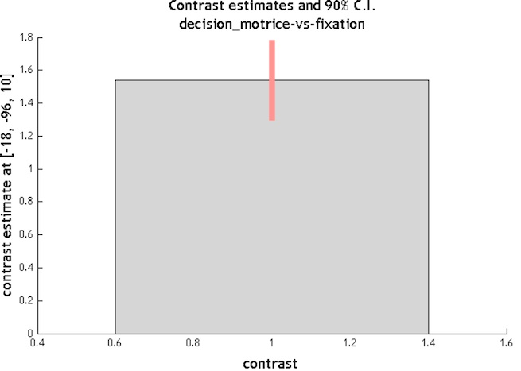
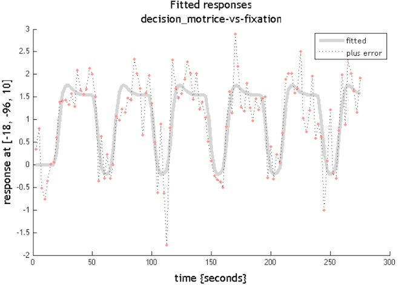
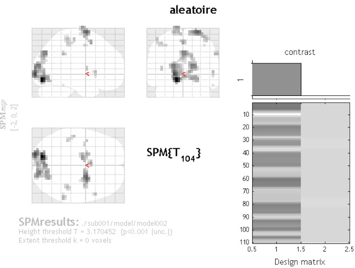
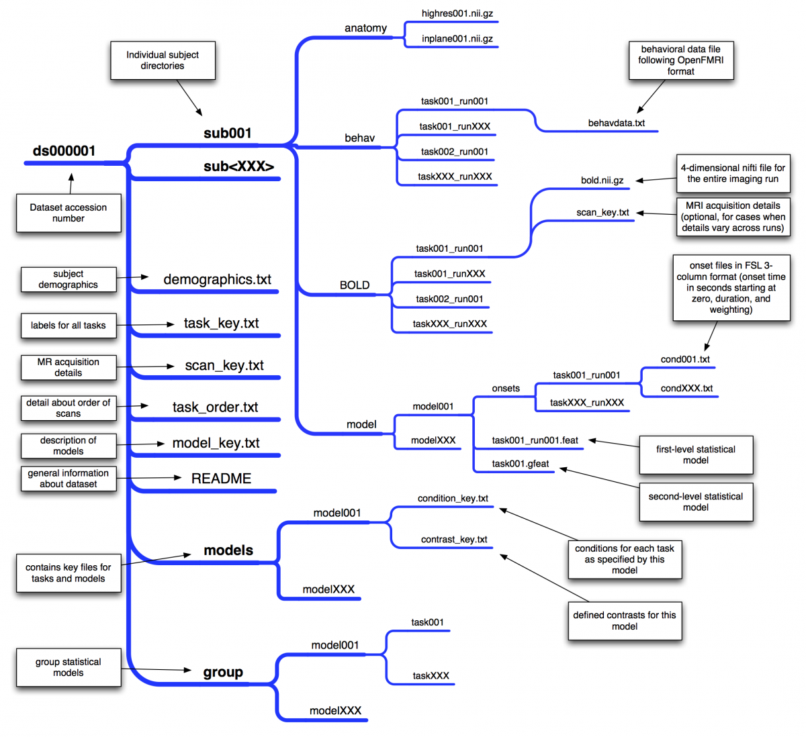
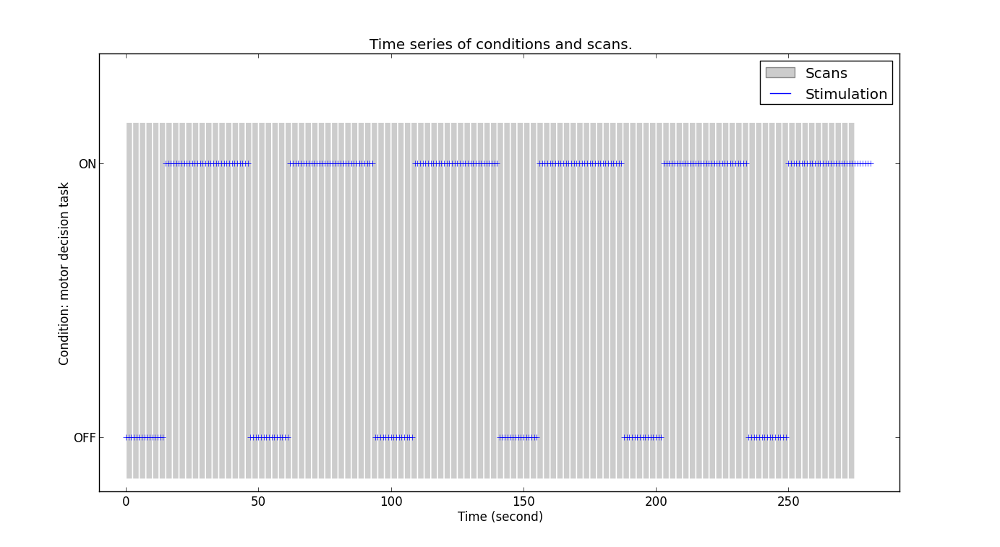

# CIRENcours2015
Analyse de données IRMf, cours du CIREN, mars 2015


# Séance 4, 24 mars 2015

Programme :

  - 9h00-9h20 : discussion sur les comparaisons multiples.
  - 9h20-9h40 : corrigé des exercices : F tests sur les régresseurs d'intérêt et de mouvement, Corrections pour les comparaisons multiples.
  - 9h40-9h55 : Paradigmes factoriels, matrices de design et contrastes
  - 9h50-10h00 : TD premier niveau sur paradigme factoriel
  - 10h10-10h10 : Principe des analyses de second niveau
  - 10h30-10h45 : TD second niveau sur paradigmes factoriel
 
####Attention le programme n'est pas à jour !
  
  


# Séance 3, 17 mars 2015 
Programme :

  - 9h-9h30 : discussion sur les deux articles à lire et reprise des points qui n'ont pas été clairs la semaine dernière quant au GLM.
  - 9h30-9h50h : corrigé des exercices : modèle aléatoire, influence du lissage spatial
  - 9h5a0h-10h10 : théorie sur les tests T et F et les types de seuillage
  - 10h10-10h45 : TD définition d'un modèle événementiel avec régresseurs de mouvements, tests T et F appropriés, interprétation des cartes d'activation
  - 10h45-11h : pause dont la durée dépendra du retard
  - 11h-11h20 : théorie sur les comparaisons multiples
  - 11h20-12h : TD sur les méthodes de correction pour les comparaisons multiples
  - 12h et plus : discussions et question supplémentaires.


## 1. Quelques observations sur le GLM

\\[
\Huge{Y=\beta X + \epsilon}
\\]


$\Large{Y}$ est notre série temporelle des mesures effectuées dans un voxel  
$\Large{X}$ est la matrice de design qu'on a spécifiée  
$\Large{\beta}$ est le vecteur des paramètres de régressions estimés de telle sorte que $\Large{\epsilon}$, l'erreur résiduelle, soit la plus petite possible

Paramètres du modèle : ils sont entrés au moment de la spécification du modèle.

### Visualisation des paramètres de régression

 Quand un modèle a été estimé, vous pouvez directement regarder les valeurs des paramètres de régression dans les images **beta_000X.nii** créées ainsi que la représentation graphique de l'estimation du modèle : 
 
 1. En utilisant le bouton `Display` de la fenêtre **Menu**, aller repérer sur l'image anatomique normalisée quelques voxels pertinents et notre leurs coordonnées "world", par exemple
   - un dans le cortex visuel où on a déjà vu que le signal était fortement corrélé à la stimulation
   - un voxel où a priori le signal ne sera pas du tout lié au traitement cognitif lié à la stimulation, typiquement en plein dans un ventricule
   - un voxel quelconque ailleurs dans le cerveau
2. Encore avec `Display`, vous pouvez noter les valeurs des coefficients de régression associés à chacun des régresseurs directement dans les images **beta_000X.nii** (attention à l'interpolation pour la visualisation dans la fenêtre **Graphics**).
3. Reprennez le modèle **model001** et choisissez d'afficher les résultats en cliquant sur le bouton `Results`, puis en sélectionnant la **SPM.mat** correspondante, puis dans la fenêtre **SPM contrast manager** le contraste **001{T} decision_motrice-vs-fication**, puis spécifiez le seuil suivant : 
  - **apply masking** : `None`
  - **p value adjustmeent to control** : `None`
  - **Threshold {T or p value}** : `1`
  - **& extent threshold {voxels}** : `0`
4. En entrant les coordonnées que vous avez notées dans l'encadré **co-ordinates** tout en bas de la fenêtre **SPM{T}: Result**, vous pouvez afficher des informations relatives aux voxels que vous aviez choisis :
  - la valeur du contraste estimé en ce point : 
        1. cliquez sur le bouton `plot` dans l'encadré **Display**
        2. choisissez dans la liste déroulante **Contrast estimates and 90% C.I.**
        3. le graphe correspondant s'affiche dans le fenêtre **Graphics**
        4. si vous changez les coordonnées, le graphe se met à jour automatiquement !

        


        
  - le graphe du signal et de la composante relative à notre régresseur d'intérêt :
        1. cliquez sur le bouton `plot` dans l'encadré **Display**
        2. dans la liste déroulante, choisissez **Fitted responses**
        3. pour **predicted or adjusted response?, choisissez `predicted`
        4. dans la liste déroulante **plot against...**, choisissez **scan or time**
        3. le graphe correspondant s'affiche dans le fenêtre **Graphics**
        4. si vous changez les coordonnées, le graphe se met à jour 

        


## 2. Spécification d'un modèle aléatoire
Même principe que pour le modèle fait à partir des données de stimulation, mais en modifiant les valeurs pour les **onsets** et les **durations**.  

Cette fois, on va voir comment enchaîner des étapes : Créez un nouveau répertoire pour le modèle aléatoire, puis le choisir comme répertoire courant.

1. Créez un nouveau répertoire pour le modèle aléatoire et le choisir comme répertoire courant:
  - ouvrez le **Batch Editor** et sélectionnez les modules suivants :
  - `BasicIO -> Fil/Dir Operations -> Dir Operations -> Change directory`
  - `BasicIO -> Fil/Dir Operations -> Dir Operations -> Make directory`
  - `SPM -> Stats -> fMRI model specification`
2. Remplissez les paramètres comme suit pour le module `Make Directory`
  - Parent Directory : /Users/sc/Documents/cours_irmf_CIREN_2015/ds000001/sub001
  - New Directory Name : model002
3. Puis pour le module Change Directory, il y a une astuce : utiliser le bouton `Dependency` qui apparaît au lieu de sélectionner le répertoire, et indiquer que vous choissez le répertoire que vous aurez créé avec le module `Make Directory` juste avant en sélectionnant `Make directory: Make Directory 'model002'` puis cliquer sur le bouton `OK`. Cf. image en dessous.
4. Vous pouvez exécuter le batch avec le petit bouton vert


Maintenant que vous avez compris le principe, vous pouvez ajouter dans ce batch la spécification du modèle, son exécution et les étapes qui vous paraissent pertinentes, puis le sauvegarder.

Pour Spécifier le modèle aléatoire :

```
Data & Design 
.Subject/Session
..Scans
..Conditions
...Condition
...Name <- renseigner ici le nom, par exemple "modele aleatoire"
....Onsets <- ici il faudra rentrer un vecteur d'onsets aléatoires
....Durations <- ici entrer une ou des valeurs aléatoires pour les durées
....Time Modulations <- ne rien changer
....Parametric Modulations <- ne rien changer
....Orthogonalise modulations <- ne rien changer
```
Exemple de vecteur aléatoire pour les onsets :

`10 15 58 60 80 120 160 199 212 230 235 245 260`

Et pour les durations :

`10 23 0 5 10 20 30 0 10 1 1 10 10`

Résultat :




Le batch correspondant à cet exemple, ainsi qu'un batch pré-mâché où vous n'avez plus qu'à remplir les informations relatives à vos path et noms de fichiers sont disponible dans le répertoire **models** sur GitHub, il suffit d'un clic droit sur le batch dans la liste pour les télécharger.

## 3. Influence des paramètres choisis pour l'analyse

Cf. article de Joshua Carp.

### Paramètres de prétraitement : le lissage spatial


### Paramètre de modèle de premier niveau : basis function

Dans la structure **SPM.mat** qui stocke l'ensemble des informations relatives à un modèle, le set de fonctions utilisées pour la convolution est enregistré, comme les autres paramètres que nous avons entrés en spécifiant le modèle.

Parmi les options pour les paramètres du modèle (bouton `Specify 1st-level` de la fenêtre **Menu**), nous avions laissé le choix par défaut, à savoir la réponse hémodynamique canonique (**HRF** pour Haemodynamic Response Function) dont le pic est à 5 secondes après l'onset neuronal et la résurgence à 15 secondes., sans dérivé et sans expansion Volterra:

```
Basis Functions
.HRF Canonical
..Model derivatives              No derivatives
Model Interactions (Volterra)    Do not model interactions
```

Pour obtenir l’expression de la HRF (Haemodynamic Response Function) en fonction du temps, vous pouvez utiliser le bouton `Review` de la fenêtre **Menu** et regarder de nouveau votre régresseur d'intérêt à partir du menu `Design` de la troisème fenêtre :

`Design -> Explore -> Session 1 -> tache_motrice`

Comme le discute l'article de Poline & Brett, la fonction de réponse hémodynamique n’a pas la même forme selon les régions cérébrales, la HRF dite canonique a été mesurée dans le cortex visuel, cf.  
[Boynton G.M., Engel S.A., and Heeger D.J.,. Linear Systems Analysis of the fMRI Signal. Neuroimage, 2012 Aug 15; 62(2): 975–984.](http://www.ncbi.nlm.nih.gov/pmc/articles/PMC3359416/)


Si nos hypothèses sont sur des régions qui sont plus loin dans les chaînes de traitement de l'information que le cortex visuel primaire, on peut s'attendre à ce que la réponse hémodynamique diffère (organisation cyto-architectonique différente, boucles de rétro-action, inputs multiples,...). On sait aussi que la réponse hémodynamique dans les régions sous-corticales diffère de la HRF mesurée dans le cortex. Par ailleurs, la réponse hémodynamique varie aussi d'un sujet à l'autre :   
[Handwerker D.A., Ollinger J.M., and D’Esposito M., Variation of BOLD hemodynamic responses across subjects and brain regions and their effects on statistical analyses. Neuroimage, 2004 April; 21(4): 1639–1651](http://www.researchgate.net/profile/John_Ollinger/publication/8649558_Variation_of_BOLD_hemodynamic_responses_across_subjects_and_brain_regions_and_their_effects_on_statistical_analyses/links/00b4952cc2ce424e94000000.pdf)

Cette déviation par rapport à la fonction canonique peut s'exprimer sous la forme d'un décalage du pic dans le temps (**Time derivatives**) et d'un étalement plus ou moins important de ce pic dans le temps (**Dispersion derivatives**).


L'expansion Volterra correspont à u problème de corrélation à l’intérieur de notre régresseur : si le timing des différents essais peut induire des effets de corrélation, il est possible de rendre compte de ces non-linéarités en utilisant un ordre 2 pour l'expansion Volterra.

## 4. Tests T et tests F

### Nouveau modèle

Cette fois on va s'intéresser à un modèle qui comportera cette fois deux régresseurs d'intérêts, en profitant du fait que le sujet répondait avec la main droite ou la main gauche en fonction de l'instruction qui apparaissait pendant la tâche de décision motrice.

Contraster les essais avec réponses main gauche versus main droite devrait nous permet de détecter les activations qui sont dépendantes de la réponse motrice puisqu'on va soustraire tout ce qui est commun aux deux conditions, notamment une bonne partie du traitement de l’information visuelle (la seule différence visuellement, c'est le mot affiché : GAUCHE ou DROITE), et des processus de sélection de l'action.

Pour sélectionner les onsets relatifs aux réponses à droite ou à gauche dans le tableau de données comportementales, vous pouvez utiliser **R** :

```r
d<-read.csv('path_vers_le_repertoire_racine_de_vos_analyses_de_donnees/ds000001/sub001/behav/data_1.txt',header=T,sep=" ")
onsets_droite<-d[d$reponse==52,"t_stim"]
write.table(droite, file = "path_vers_votre_repertoire_pour_le_modele/onsets_droite.txt",row.names = FALSE,col.names = FALSE)
onsets_gauche<-d[d$reponse==49,"t_stim"]
write.table(gauche, file = "path_vers_votre_repertoire_pour_le_modele/onsets_gauche.txt",row.names = FALSE,col.names = FALSE)
```

Vous pouvez donc construire un nouveau modèle qui comporte deux conditions :

```
Data & Design 
.Subject/Session
..Scans
..Conditions
...Condition
...Name <- mettre reponse_main_droite
....Onsets <- rentrer ici le vecteur d'onsets correspondants
....Durations <- mettre zéro comme durée
....Time Modulations <- ne rien changer
....Parametric Modulations <- ne rien changer
....Orthogonalise modulations <- ne rien changer
...Condition
...Name <- mettre reponse_main_gauche
....Onsets <- rentrer ici le vecteur d'onsets correspondants
....Durations <- mettre zéro comme durée
....Time Modulations <- ne rien changer
....Parametric Modulations <- ne rien changer
....Orthogonalise modulations <- ne rien changer
```


Pour le reste des paramètres, vous pouvez choisir les mêmes paramètres que les autres modèles, et procéder à l'estimation.

Lorsqu'on vérifie la matrice de design, avec le bouton `Review` : on observe alors bien les 2 régresseurs.
Pour voir leur forme plus en détail, procéder comme auparavant :

`Design -> Explore -> Session 1 -> reponse_main_droite`

et

`Design -> Explore -> Session 1 -> reponse_main_gauche`

### Test F

C'est un test non directionnel qui permet de regarder si au moins l'un des régresseurs que l'on considère a une influence sur la série temporelle du signal dans les voxels. Il s'agit de comparer un modèle et son sous-modèle en faisant une ANOVA entre les 2 modèles respectifs.

Typiquement on commencer par regarder l’ensemble de nos régresseurs d’intérêt, dans notre cas les deux régresseurs **right** et **left**, on construit alors un contraste pour un test F de la façon suivante :

Ouvrez la fenêtre **Contrast editor** en passant par `Results` et la sélection de la **SPM.mat** qui correspond à votre modèle, puis cliquez sur le bouton `Define new contrast...`

Dans l'encadré **name**, écrire `Effects_of_interest`  
Dans l'encadré **type**, cocher **F-contrast**
Puis entrez la matrice de contraste (**contrast weights matrix**) proprement dite dans l'encadré **contrast**

```
1 0 
0 1
```

Au lieu de rentrer la matrice, vous pouvez tout aussi bien utiliser le champ **columns for reduced design** où vous spécifiez les numéros des régresseurs **que vous ne souhaitez pas prendre en compte**, dans notre cas, le troisième régresseur :

`3`

Effectivement il s'agit là du modèle réduit par rapport au modèle complet avec les deux régresseurs d'intérêt en plus. L'ANOVA entre ces deux modèles ne sera significative que pour les voxels où ces deux régresseurs d'interêt expliquent une part suffisamment importante de la variance du signal.


### Test T

Les tests T sont ceux qu'on a déjà utilisés, ils permettent de comparer différentes conditions.

####Attention : SPM ne montre sur la fenêtre de **Résultats** que les valeurs positives !

Avec ces T-tests, on peut naïvement les résultats pour un seuil choisi à `p<=0.001 et 0 voxels` :

  -	gauche vs droit (le sujet répond avec la main gauche) : l'affichage sur la glass-brain par défaut est en conventions neurologique : on observe bin un cluster activé dans cortex moteur droit. 
  -	droite vs gauche : au seuil choisit on n’observe rien.

Attention, on ne peut pas dire qu'il n'y a pas d'activation motrice ! On sait pertinament que le sujet a répondu puisqu'on a défini les régresseur à partir de l'enregistrement par le système de stimulation d'un appui sur un bouton.  
C’est juste une question de seuil. Si on change la valeur de seuil pour une valeur beaucoup plus libérale (par exemple `p <=1 et 0 voxel`), on observe de l’activité cérébrale quasiment partout. Ne pas voir d'activation sur le glass-brain après un test ne veut donc pas dire qu’il n’y a pas d’activation ça veut juste dire que ça ne sort pas statistiquement. Il n'est donc comme d'habitude pas possible de conclure sur un effet non significatif dans le cadre des statistiques fréquentistes.


## 5 Le problème des comparaisons multiples

Jusqu’ici on a travaillé qu’avec des seuils non corrigés (.001) or le nombre de voxels sur lesquels le modèle est appliqué s'élève à environ 26000. Pour un seuil alpha  de 0.001, il y a donc 0.001*26000 = 26 voxels qui peuvent être activés par hasard.  
Quand on reprend notre contraste left vs right, on se rend compte de l'importance de regarder le nombre de voxels qui constituent ce cluster (colonnne kE : 18 voxels).  
Donc ça pourrait être dû au hasard, surtout qu'on a de la corrélation spatiale et qu'on a lissé avec un kernel à 8mm de FWHM, donc ce n'est pas étonnant qu'un voxel dont le signal  
Statistiquement ça ne tient pas le choc non plus. 

### 1. Correction family-wise de Bonferroni

Il est tout à fait possible d'appliquer la méthode de correction classique de Bonferronni, c'est à dire d'appliquer un nouveau seuil égal au seuil alpha divisé par le nombre de comparaisons effectuées.


### 2. Correction family-wise Théorie des Champs Aléatoires (gaussiens)


Plusieurs types de stat : liées au pic (critère voxel par voxel) ou travailler au niveau du cluster (estimer quelle est la probabilité de trouver un certains nombres de voxels par hasard puis le nombres de voxels par hasard qui pourrait être côte à côte). En effet nos voxels ont de fortes corrélations spatiales (de plus, on a smoothé le signal à 8 mm).


On peut calculer la proabilité de trouver un cluster d’une certaine taille. Il y a des méthodes non paramétriques et il y a des estimations qui calculent le nombre de voxel par cluster en tenant compte de la résolution spatiale de notre image (cf fichier RPV que l’on ouvre avec Mango). C’est une image de la corrélation spatiale dans mes données. Par rapport aux donnés originales, c’est un calcul d’un resel (élément de résolution) : donne une idée de quelle est la grosseur de quelque chose de cohérent en terme de signal, de spatialement corrélé, donne une estimation de la résolution réelle de l’image. 


je prends un point je vois que c’est = 0.02 (si je divise 1/0.02 = 50). 
Gaussian RFT : estimation pour calculer les éléments indépendants. 
Estimer combien j’ai de trucs indépendants dans mon image ce qui me permet de corriger pour les comparaisons multiples (correction sur ce qui a du sens). Cette méthode tient compte de la nature spatiale du signal qui est d’être corrélée à un certain niveau. 
Les méthodes de correction (FWE - de type Bonferroni) qui joue sur le seuil alpha. On peut l’appliquer dans Contrasts (petite fenêtre) à côté de design - significance level - set to FWE .05.

Seuil .01 et correction Bonferroni pour 26 000 voxels = mon seuil fait 0.001/26000 = 3.8 par 10 moins 8.
Je définis une p value qui est a 3.8 10-8 (0.000000038).

Bonferroni est un peu plus conservatrice que la méthode FWE qui prend en compte le nombre de resel puisqu'il suffit que 

Si on regarde des contrastes d’intérêt on a de fortes chances que les contrastes ne survivent pas à notre correction.

2 autres méthodes de correction existent : 
FDR (on change les deux seuils : alpha et beta). Cette méthode est encore moins stringente que la méthode par les resel. FDR permet de sortir plus de résultats. La manière de faire les corrections de type FDR a changé entre SPM 5 et SPM 8. 

Contrôler les faux positifs que l’on voit sur nos images : on considère un seuil acceptable de faux positifs. On prend une carte d’activation, on prend touts les valeurs de p que l’on classe et on choisit le seuil que l’on veut supporter (eg. 5% de faux positifs).  

Faire un premier test a un seuil non corrigé et ré-utiliser pour la correction les valeurs de FDR soit pour les peak ou les cluster puis voir les interprétations qui divergent entre les peak et les cluster. 

### 2. Correction family-wise Théorie des Champs Aléatoires (gaussiens)


SPM impose la correction FWE, mais si je veux faire du FDR, je regarde ce qui est écrit dans mon interface graphique (en bas à gauche), je note FDR = .33 (le chiffre) ainsi que le nombre de cluster juste à côté. 

Pour les ROI, on va corriger uniquement par le nombre de voxel dans la région d’intérêt. Mais si on se base sur une toute petite petite région, diviser par le nombre de voxel pour corriger les comparaisons multiples est ridicule...

Exo à faire : Regarder l’influence que peuvent avoir les paramètres de mouvement (cf Batch de Sylvain). Faire des t-test des f-test etc et regarder les différentes méthodes utilisées pour les comparaisons multiples. 


# Séance 2

## 1. Organisation des données

###Les données en IRM fonctionnelle d'activation
Elles comportent au minimum

  - des données d'imagerie cérébrale : images au format DICOM ou NIFTI ou autre
  - des informaitons sur les paramètres d'acquisition
  - des données comportementales : .csv ou .txt au format UTF-8, habituellement générées automatiquement par votre logiciel de stimulation
  - des informations sur la tâche, que vous devez avoir écrites (préparez-vous à expliquer votre tâche rapidement et précisément, ça aide pour les talks/posters/ascenseurs)


###Toujours savoir ce qu'il y a dans vos données !

Trois sources d'information principales

  - votre cahier de manip, correctement rempli pendant les acquisitions
  - le personnel et les documents au CIREN, voire au CRC. N'hésitez pas à poser vos questions à Stéphanie Lion, notre manip de recherche
  - les fichiers que vous avez récupéré (correctement nommés et organisés si vous avez bien fait votre travail)

Pour les données d'imagerie, utilisez un viewer DICOM pour récupérer les informations sur les séquences que vous avez acquises.
Ex :

 - Mango, gratuit et conçu spécialement pour la recherche en imagerie cérébrale
 - ImageJ, gratuit et léger, généraliste
 - Osirix, pour mac
 - Les consoles constructeur, comme l'AW General Electric au CIREN

###Réorganisation des données dans votre répertoire d'analyse

Suivre les recommandantions de [Open fMRI](https://openfmri.org/content/data-organization) qui vous aideront à ne pas oublier d'information et à toujours conserver une structure propre pour vos données.




Créer un répertoire qui sera celui de base pour toute l'analyse de données IRMf pour ce cours
ex :

`/home/sc/Documents/cours_irmf_CIREN_2015`

Vous pouvez construire l'arborescence en utilisant votre navigateur de fichier préféré ou en ligne de commande de la façon suivante :

```bash
mkdir ~/Documents/cours_irmf_CIREN_2015
cd ~/Documents/cours_irmf_CIREN_2015
mkdir ds000001
touch ds000001/README
touch ds000001/demographics.txt
touch ds000001/task_key.txt
touch ds000001/scan_key.txt
touch ds000001/model_key.txt
mkdir ds000001/models ds000001/group
mkdir ds000001/sub001 
mkdir ds000001/sub001/anatomy ds000001/sub001/behav ds000001/sub001/BOLD ds000001/sub001/model
```

Si vous avez plusieurs sujets, vous pouvez facilement créer toute l'arborescence d'un coup avec une petite boucle `for`

```bash
for suj in {1..25};
do
    echo "arborescence pour sujet numero $suj"
    if [[ $suj -lt 9 ]];
    then
        mkdir ds000001/sub00$suj 
        mkdir ds000001/sub00$suj/anatomy ds000001/sub00$suj/behav ds000001/sub00$suj/BOLD ds000001/sub00$suj/model
    else
        mkdir ds000001/sub0$suj 
        mkdir ds000001/sub0$suj/anatomy ds000001/sub0$suj/behav ds000001/sub0$suj/BOLD ds000001/sub0$suj/model
    fi
done
```

Évidemment vous pouvez faie la même chose en python ou autre langage de votre choix.


###Il vous reste à remplir cette arborescence avec les données que vous avez.

Je vous conseille :

1. de ne **jamais** modifier vos données brutes, vous pouvez monter le volume qui contient vos données en lecture seule pour être tranquille, par exemple avec tout système qui supporte un shell avec `mount -o rdonly`
2. de toujours utiliser un utilitaire de copie fiable, par exemple **rsync**, qui conserve les propriétés des fichiers de départ et vous aidera à reprendre votre copie proprement si elle est mar malheur interrompue.

```bash
sudo mount -o rdonly /dev/identifiant_de_votre_partition /media/point_de_montage
# creation du repertoire d'analyse de données IRMf
cd ~/Documents/cours_irmf_CIREN_2015/
# pour notre run d'images fonctionnelles
rsync -a /media/point_de_montage/mon_stock_de_data/sujet01/DICOM/PA0/ST0/SE2 ds000001/sub001/BOLD/
mv ds000001/sub001/BOLD/SE2 ds000001/sub001/BOLD/task001_run001_dicom
# on prépare déjà un petit répertoire pour la conversion
mkdir ds000001/sub001/BOLD/task001_run001_nifti3d
# et pour l'image structurelle
rsync -a '/media/point_de_montage/mon_stock_de_data/sujet01/DICOM/PA0/ST0/SE9' ds000001/sub001/anatomy/
mv ds000001/sub001/anatomy/SE9 ds000001/sub001/anatomy/anatomy_dicom

```

Sous mac pour monter une partition en lecture seule, vous pouvez utiliser la commande `diskutil`

```bash
# pour identifier une partition (de toute façon diskutil prend en compte tout le disque pour monter et démonter)
diskutil list
diskutil info /dev/ma_partition
# pour monter un disque lecture seule
diskutil unmountDisk /dev/mon_disque
diskutil mountDisk readOnly /dev/mon_disque
```

Remplissez bien aussi les fichiers texte qui décrivent vos données, dans l'idéal, rédigez la partie méthode d'acquisition de votre article à ce moment-là !  
cf.  
[Poldrack R. A., Fletcher P. C., Henson R.N., Worsley K. J., Brett M., and Nichols T. E., Guidelines for reporting an fMRI study. Neuroimage. 2008 Apr 1; 40(2): 409–414 | doi:  10.1016/j.neuroimage.2007.11.048](http://www.sciencedirect.com/science/article/pii/S1053811907011020)

## 2. Rappels sur l'interface de SPM12 standalone

### 2.1 lancement de SPM12 standalone

1. Lancez SPM12 standalone
2. Cliquez sur le bouton `fMRI`
3. vous voyez apparaître trois fenêtres :
  - **SPM12 (6225): Menu** : le menu, celle qui est toute verte, généralement en haut à gauche, avec les boutons regroupés par phase de traitement des données
  - **SPM12 (6225): Graphics** : celle à droite où s'afficheront toutes les sorties graphiques, qui porte le logo suivi de quelques informations et liens
  - **SPM12 (6225)** généralement en bas à gauche avec écrit "SPM12" en filigrane, qui sert à afficher la barre de progression des traitement et plus tard à beaucoup d'autres choses.

### 2.2 Changement de répertoire  

3. Je vous conseille d'entrée de jeu de vous placer dans votre répertoire d'analyse de données, pour ce faire, dans la fenêtre de menu, cliquez sur la liste `Utils` et sélectionnez `CD`
4. Un pop-up **Select new working directory** s'ouvre, il est constitué de deux panneaux
  - à gauche le panneau de **navigation**, où un clic simple sur un nom de répertoire permet d'y descendre
  - à droite le panneau de **sélection**, où un clic simple sur un nom de répertoire ou de fichier le séLectionne, il disparaît alors du panneau de sélection et s'affiche 
  - en bas, dans le panneau qui récapitule les objects sélectionnés
5. Sélectionnez donc votre répertoire d'analyses et cliquez sur le bouton `Done` quand vous avez fini

Remarques :

  - le champ **Filter** s'utilise avec des expressions régulières
  - les trois champs en haut : **Dir**, **Up** et **Prev** aident à la navigation dans l'arborescence.
  - la première ligne de la liste déroulante **Prev** contient toujours le path vers le répertoire d'installation de SPM12 standalone.

## 3. Conversion des données avec SPM12 standalone

Malheureusement avec SPM, il faut procéder en deux étapes.
Comme SPM n'est pas bien conçu pour le traitement des nifti 4D (contrairement à FSL...), il vaut mieux faire la conversion depuis les DICOM directement avec SPM, sans passer par un autre logiciel, sinon l'opération de concaténation des images en une seul fichier 4D risque de comporter des erreurs.
Par ailleurs si vous avez des données nifti compressées (.nii.gz), SPM ne les supporte pas trop (contrairement à FSL...), donc décompressez vos données en .nii avant de les copier.

 
### 3.1 Conversion des dicom en nifti 3D

####Image anatomique
1. Dans la fenêtre de menu , cliquez sur le bouton `DICOM Import`, ce qui ouvre une fenêtre pop-up **Batch Editor**
2. Dans la colonne de droire, il va falloir spécifier les valeurs de paramètres nécessaires. Tout paramètre qu'il faut nécessairement renseigner est indiqué par `<-X`
3. Sélectionner le champs **DICOM files** et appuyez sur le bouton `Specify...`
4. Une fenêtre pop-up de sélection de fichiers s'ouvre. Naviguez dans votre arborescence avec la fenêtre de gauche pour sélectionner le répertoire qui continent les images DICOM, c'est-à-dire, depuis votre répertoire de travail :
`ds000001/sub001/anatomy/anatomy_dicom`
5. Sélection des images DICOM : dans la fenêtre de sélection, faites un clic droit puis cliquez sur le petit `Select All` qui pop-up. Vérifiez que vous avez bien sélectionné 176 images.
6. Sélection du répertoire : même principe mais sélectionnez le répertoire où seront les images anatomiques `ds000001/sub001/anatomy`
7. Vérifiez que vous avez bien sélectionné le format d'image : `.Output image format`:`Single file (nii) NIfTI`
8. Lancez le batch avec le petit triangle vert sur la ligne d'icônes en haut de la fenêtre **Batch Editor**.
9. Une fois la conversion effectuée, vous devez voir un nouveau fichier dans le répertoire `ds000001/sub001/anatomy` : `stest-0011-00001-000001-01.nii`
10. donnez-lui un nom plus convenable, par exemple :
  - En ligne de commande `mv ds000001/sub001/anatomy/stest-0011-00001-000001-01.nii ds000001/sub001/anatomy/anat.nii `
  - avec l'interface de **Batch Editor** : dans la fenêtre menu, cliquez sur `Batch`, puis parmi les onglets de la fenêtre **Batch Editor**, sur `BasicIO -> File/Dir Operations -> File Operations -> Move/Delete Files`, puis remplissez les paramètres de la façon suivante :

```
Files to move/copy/delete     ...ds000001/sub001/anatomy/stest-0011-00001-000001-01.nii
Action
.Move and Rename
..Move to                     .../cours_irmf_CIREN_2015/ds000001/sub001/anatomy/
..Pattern/Replacement List
...Pattern/Replacement Pair
....Pattern                   stest-0011-00001-000001-01.nii
....Replacement               anat
..Unique Filenames            Don't Care
```

####Images fonctionnelles
Il suffit de faire pareil avec en sélectionnant

  - les images fonctionnelles du répertoire `ds000001/sub001/BOLD/task001_run001_dicom`, vérifiez que vous avez bien 4620 fichiers sélectionnés.
  - le répertoire où ranger les nifti 3D : `ds000001/sub001/BOLD/task001_run001_nifti3d`

Une fois les images converties (ça prend plusieurs minutes), vous devez voir 110 nouveaux fichiers créés. Si ce nombre vous étonne ainsi que les noms des fichiers, retourner voir les informations des headers DICOM pour une image fonctionnelle.

Il n'est pas nécessaire de renommer les images fonctionnelles fraîchement covnerties en nifti.


####Remarques :

  - vous pouvez faire l'étape 3 en cliquant d'abord sur le bouton `Batch` du menu, puis en sélectionnant parmi les onglets de la fenêtre **Batch Editor** `SPM -> Util -> Import -> DICOM Import`.
  - pour modifier une sélection, il faut à nouveau cliquer que le bouton `Specify...`, puis il suffit de cliquer sur un des item de la liste de sélection en bas de la fenêtre pour le retirer de la liste, sélectionnez ensuite un autre fichier comme précédemment.


### 3.2 Conversion des nifti 3D en nifti 4D
Intérêt : un seul fichier pour toute la série temporelle ! C'est beaucoup moins pénible à manipuler et ça n'encombre pas l'ordi avec des tas de fichiers qui sont une plaie pour les transferts et les sauvegardes.

Dans la fenêtre menu, cliquez sur `Batch`, puis parmi les onglets de la fenêtre **Batch Editor**, sur `SPM -> Util -> 3D to 4D Conversion`, puis remplissez les paramètres de la façon suivante :
```
3D Volumes       # sélectionnez comme vous savez désormais le faire toutes les images .nii du répertoire où vous venez de les créer. Vérifiez que vous en avez bien sélectionné 110.                                                                       
Output Filename  # choissisez un nom approprié, cf [Open fMRI](https://openfmri.org/content/data-organization) task001_run001.nii
Data Type        # laisser comme c'est sauf si vous savez exactement pourquoi changer de format
```

Vous devez voir deux fichiers :

  - un fichier image task001_run001.nii
  - un fichier task001_run001.mat (qui contient l’information d’orientation de l’image dans l’espace) : c’est celui-ci qui va être modifié par les opérations de recalage des prétraitements. 


## 4. Vérification des données

### 4.1 Visualiser la série temporelle complete
Utiliser de préférence **FSLview** dont le petit outil qui permet de voir la série temporelle d'images fonctionnelles comme un film (l'icône ressemble à une pellicule de film) est extrèmement pratique pour vérifier globalement les données :

  - vérification de la bonne acquisition du cerveau du sujet (pas de bout du cerveau coupé par la matrice d'acquisition)
  - vérification d'influence des artefacts de susceptibilité (notamment dans les régions orbito-frontals, frontopolaires, les hippocampes et les amygdales).
  - détection de volumes artefactés

### 4.2 Observations des sources de variance dans le signal
Visualiser les séries temporelles : avec FSLview, dans les onglets, sélectionnez `Tools -> Timeseries`.

Remarques :

  - variations du signal en dehors du la tête du sujet (bruit)
  - variations du signal en dehors du tissu cérébral (regarder dans les ventricules)
  - On peut remarquer de fortes variations à haute fréquence (pulsation cardiaque) dans les régions fortement vascularisées, par exemple au niveau des carotides internes.
  - variations associées aux mouvements de tête du sujet (pattern moiré/strié)
  - variations dans les régions touchées par les artefacts de succeptibilité
  - drift du signal (variation lente)
  
### 4.3 Visualisation de la position des images dans l'espace
On commence par vérifier que le sujet n'a pas bougé pendant l'acquisition de l'image anatomique (stries sur l'image), ni entre cette acquisition et celle de la première image fonctionnelle.

1. Dans la fenêtre de menu de SPM, cliquez sur le bouton `Check Reg`.
2. Sélectionnez votre image anatomique et la première frame de l'image fonctionnelle 4D.
3. Vérifiez si les deux images sont correctes (pas d'artefact bizarre)
4. Vérifiez que l'ensemble du cerveau (en tenant compte des artefacts de susceptibilité, évidemment) et plus que les structures cérébrales principales (corps calleux, lobes, ventricules) sont bien au même endroit sur les deux images, sinon ça veut dire que le sujet a bougé et qu'il faudra peut-être recaler les images à la main.


## 5. Rappels sur les prétraitements
Avant d'appliquer le modèle d'analyse en régression multiple (GLM), il faut nettoyer le signal, ce sont les **prétraitements**. Voici par exemple la série des prétraitements classiques selon les recommandations pour le logiciel SPM à effectuer en vue d'une analyse d'un groupe de sujets.

  0. **recalage rapide** des images anatomiques et fonctionnelles sur un template, c'est ce qu'on vient de faire juste avant.
  1. **réalignement** : estimation des mouvements de la tête du sujet, qui consiste à calculer les paramètres d'un recalage rigide entre chaque volume fonctionnel et une référence, habituellement le premier volume
  2. **recalage intermodal** : cette fois on recale automatiquement les images anatomiques sur l'image fonctionnelle de référence 
  3. **segmentation** de l'image anatomique et calcul des paramètres de normalisation, c'est-à-dire le champ de déformation à appliquer à l'image anatomique pour qu'elle colle à un template (opération qui déforme les images)
  4. **normalisation** : application de ces paramètres de ce champ de déformation à l'image anatomique et aux images fonctionnelles. **À ce moment, les données sont modifiées !**
  5. **lissage spatial** des images normalisées par un kernel gaussien :
    - pour avoir un meilleur rapport signal sur bruit
    - parce qu'on vient de modifier les propriétés locales des images (interpolation due au recalage et voxels chamboulés par la normalisation)
    - parce qu'on a besoin de données gaussiennes pour appliquer la régression linéaire massivement univariée

####Remarque importante :  
il est **toujours** préférable de réfléchir aux prétraitements à appliquer en rapport avec vos hypothèses et vos analyses, et de les optimiser pour votre étude.

### 5.1 Recalage rapide (repère MNI)

Il s'agit de positionner les images sur le même repère que les template qu'on utilise ensuite pour la normalisation.  En effet, les algorithmes utilisés par SPM sont optimisés pour des images qui sont déjà proches l'une de l'autre.
On estime la transformation à appliquer en travaillant sur l'image anatomique, qui est plus précise donc où il est plus facile de voir les structures cérébrales. On appliquera cette même transformation à toutes les images fonctionnelles ensuite.

Principe :

- mettre l'origine de l'image sur la commissure antérieure
- rapprocher l'orientation de celle du template (cerveau moyen) : plan xy qui passe par CA-CP, plan yz sur la scissure inter-hémisphérique.
- on n'est pas au millimètre près

Rentrer les valeurs suivantes dans le tableau en bas à gauche :

transformation|valeur
--------------|----
right {mm}    | 1.4
forward {mm}  | -58
up  {mm}      | 18.9
pitch {rad}   | 0.26
roll  {rad}   | -0.03
yaw {rad}     | 0.06

**Ne pas toucher aux `resize {x, y ou z}` !**
 
Pour appliquer la transformation aux images

1. cliquez sur le bouton `Reorient...`
2. vérifiez que l'image anatomique est déjà sélectionnée (ne pas hésiter à ajuster la taille de la fenêtre pour y voir les path en entier)
3. sélectionnez aussi toutes les frames de l'image fonctionnelle 4D (en mettant un filtre `Inf` à la place du `1`)
4. cliquez sur le bouton `Done`
 
Vérification : bouton `Chek Reg` puis sélectionner l’image anatomique et une frame de image fonctionnelle, par exemple en en entrant dans le champs de filtre le numéro de la frame.  
On vérifie alors que les deux images sont bien alignées.

### 5.2 Réalignement
 
Avoir toujours les mêmes parties du cerveau dans chaque voxel
On prend une référence soit une image moyenne soit la première

- Realign estimate
- Créer une "New Session" puis Sélectionner cette session 
- Specify puis choisir les images BOLD« inf » (sans les duplicatas)
(aide pour retrouver les fichiers cibles s'ils ont été renommés : `^f.*` va permettre de ne sélectionner que les fichierscommençant par f)
- Num passes : register to first
- play

En sortie, SPM propose affiche dans la fenêtre graphique deux graphes :
 - les paramètres estimés pour les trois translations (en mm)
 - les paramètres estimés pour les trois rotations (en degrés).
 Permetde vérifier l’ampleur du recalage pour chaque image et chaque translation etangle
 
  J'obtiens un fichier rp_func4D.txt
  
 Quelles sont les transformations de réalignement qui ont été appliquées à chaque image fonctionnelle ?

Il faut repérer les artefacts.
 
 
### 5.3 Coregister estimate
On calcule les paramètres de recalage (pour déplacer sans déformer !) de telle sorte que l'image anatomique soit dans le même repère spatial que l'image fonctionnelle de référence. Il s'agit donc encore d'un recalage rigide (6 degré de liberté : 3 translations et 3 rotations).  
**Reference image** :1ère image fonctionnelle uniquement (on garde la première image fonctionnelle comme référence et on bouge l'anatomique)  
**Source image** : image anatomique

 
### 5.4 Segmentation (seulement sur l'anat)

Calcul des déformations nécessaires à mettre en place sur le cerveau pour normaliser par la suite.

Objectif: Séparer matière grise, matière blanche, liquide céphalo-rachidien  
Volumes : je prends mon image anatomique.  
il faut descendre tout en bas de la fenêtre pour bien voir le champs **Déformation fields**, pour lequel on indique "inverse et forward".

Explications sur ce dernier point :

- le champs de déformation direct "forward" est celui qu'il faut appliquer à l'image anatomique (et par conséquent aux imaes focntionneles recalées avec cet image structurale) afin de la transformer en une image qui a la même forme que le template MNI. Ainsi, une activation repérée sur les fonctionnelles normalisées après une analyse de groupe pourra être décrite par ses coordonnées MNI et identifiée sur un atlas.
- le champs de déformation "inverse" est celui qu'il faut appliquer aux voxels template pour retrouver les voxels correspondants pour le cerveau particulier d'un des participants. C'est notamment utile lorsqu'on veut utiliser une analyse en région d'intérête (plus d'explications à ce propos dans la cinquème séance) en définissant une région sur un atlas que l'on va reporter sur l'anatomie propre d'un participant (en contr(olant derrière par la morphologie des giri et sulci que ça ne fait pas n'importe quoi).

### 5.5 Normalisation
Maintenant on va modifier nos images.  
Bouton `Normalize`  
Deformation field: Selectionner le nouveau fichier obtenu qui représente la déformation en chaque point (Y-anat va de notre image autemplateet in versement pour inverse y-anat) dans deformation field  
Image to Write : On va choisir les images à réécrire« image to write » : les anat PUIS toutes les fonctionnelles (EN 2 FOIS)  
Voxel Size : je choisis la taille en mm des voxels dans l'image d'arrivée (par ex : l'image anat était en 1 x 1 x 1, je la ré-écris en 1 x 1 x 1). Même chose avce les images fonctionnelles qui sont en 3 x 3 x 3.  
On obtient un fichierr pour l'image normalisée qui commence par "w"  
`Check Reg` : ouvrir les images avant et après normalisation. 

Message erreur: error in job execution
 error using => MATLABbatch system
 
### 5.6 - Lissage spatial
Moyennage de la valeur d'un voxel avec les voxels voisins (plus la taille du filtre augmente plus le moyennage inclus de voxels voisins)  
`Smooth` = lissage spatial.  
Sélectionner les images fonctionnelles qu'on vient de normaliser ("w...") : ne pas oublier de mettre   ^w.*  et "inf" pour prendre bien toutes les images. 
Indiquer la taille du filtre gaussien (FWHM) : 8 (mm isotropiques)
On obtient un fichier commençant par "sw"  
`Check reg` : je choisis mes images "w" et "sw" en BOLD. L'une est plus floue que l'autre car elle a été smoothée.

#### Remarque :
Théoriquement on ne pourra par la suite interpréter que les clusters d'activation dont la taille est supérieure ou égale à la valeur du kernel choisi pour le lissage spatial (ici 8 mm).


## 4. Principe de l'analyse

On veut trouver les régions cérébrales impliquées dans le processus cérébral visé par la tâche qu'on fait faire au sujet.
Dans ces régions, le signal devrait varier comme la modulation qu’on impose au sujet par le paradigme expérimental. La série temporel du signal dans ces voxels devrait suivre la série temporelle des conditions comportementale.
 
### Le GLM
Le principe de base pour l'analyse, c’est la corrélation entre notre signal et la modulation qu'on impose par le paradigme expérimental.  
L'analyse se fait par régression multiple : dans chaque voxel, on va estimer à quel point cette modulation contribue au signal. On appelle cette méthode "massivement univariée".


### Petits soucis de données corrélées
Comme d'habitude en statistiques, la régression ne fonctionne que si les données sont indépendantes. Or les mesures dans nos voxels (qqs mm3) ne sont pas indépendantes, elles sont corrélées spatialement pour des raisons biologiques évidentes.  
Et pire : dans un même voxel, les mesures sont corrélées temporellement puisque le signal BOLD a une fonction de transfert qui étale la réponse neuronale dans le temps sur une dizaine de secondes.
 
Les statisticiens ont bien galéré a trouver les bonnes méthodes statistiques pour prendre en compte ces corrélations temporelles.  
cf article :  
[Poline J.-B., and Brett M., The general linear model and fMRI: Does love last forever? NeuroImage 62 (2012) 871–880](http://projects.iq.harvard.edu/files/imagenesmedicas/files/polinekd.pdf)
 
Aujourd’hui des méthodes bayésiennes permettant d’analyser voxel par voxel les autocorrélations temporelles plutôt que d'estimer un modèle d'auto-régression sur tout le cerveau.
Voici un lien vers un rapport technique écrit par l'équipe du FIL : [Penny W.D., and Flandin G. Bayesian analysis of single-subject fMRI: SPM implementation. Technical report, Wellcome Department of Imaging Neuroscience, 2005](http://www.fil.ion.ucl.ac.uk/spm/doc/papers/vb3.pdf)  
WikiSPM est aussi bien fait si on a besoin d’aide sur ces nouvelles méthodes.


### Spécification du modèle

La manip est construite de la façon suivante :  
lorsqu'apparaît une croix de fixation (durée 15s) le sujet doit la fixer, sans appuyer sur quelque bouton que ce soit.  
En alternance avec cette tâche de fixation, il y a une tâche de décision motrice : pendant une période de 32 secondes, des instructions sous forme d'un mot affiché à l'écran : soit "DROITE" soit "GAUCHE", vont s'afficher. Alors le sujet doit appuyer le plus rapidement possible après apparition de l'instruction, mais sans se tromper, sur un bouton, avec le pouce de la main correspondant à l'instruction.  
Les instructions "DROITE" et "GAUCHE" sont randomisées, l'intervalle de temps entre deux instructions consécutives aussi.


Dans le cadre de la régression linéaire qu'on utilise pour analyser notre signal, le régresseur qui décrit la série temporelle des blocs d'instruction motrice est une variable indicatrice qui vaut 0 pour chaque temps de mesure auquel le sujet était soumis à la tâche de fixation et 1 pour chaque temps de mesure auquel le sujet était engagé dans la tâche de décision motrice.
Pour SPM, une façon de décrire cette variable indicatrice, au lieu de l'expliciter sous forme d'une série de 0 et de 1 (en fait c'est possible ainsi), consiste à définir le régresseur par la donnée de 4 informations :

- un nom
- un vecteur de temps de début de chaque période où le sujet effectue la tâche de décision motrice
- un vecteur de durée de chacune de ces périodes
- préciser
  - s'il faut considérer une modulation paramétrique pour ce régresseur (explications sur ce sujet dans une prochaine séance)
  - et/ou une expansion de type Volterra pour prendre en compte des effets de non-linéarité correspondant à des corrélations entre essais
  -  puis si ces modulations doivent être orthogonalisées.
 
C'est ce que vous propose l'interface graphique sous les termes suivants

```
Data & Design 
.Subject/Session
..Scans
..Conditions
...Condition
...Name <- renseigner ici le nom, par exemple "decision motrice"
....Onsets <- ici il faudra rentrer un vecteur d'onsets, c'est-à-dire des temps de début de chaque bloc, ces valeurs dépendent évidemment de ce que vous avez choisi comme "Units for design au tout début de la liste des paramètres qui spécifient le modèle. De préférence, utiliser les secondes si vous ne voulez pas risquer d'erreur en faisant les conversions vous-mêmes
....Durations <- ici entrer une valeur (si tous les blocs ont la même durée), ou un vecteur de valeurs si ce n'est pas le cas et évidemment ce vecteur doit avoir le même nombre d'éléments que le vecteur d'onsets
....Time Modulations <- ne rien changer à moins de savoir ce que vous faites
....Parametric Modulations <- on n'a aucune raison de considérer une modulation paramétrique pour le moment
....Orthogonalise modulations <- laisser comme c'est de toute façon on n'utilise pas de modulation pour le moment.
```

####Pour ce qui est des valeurs à prendre en compte pour le vecteur d'onsets, voici deux façon de procéder.

####1. À partir des informations a priori sur la stimulation
La manip est constituée de 12 blocs en tout, avec en alternance 6 blocs de fixation et 6 blocs d'instructions motrices.
Si on se base sur ces informations pour construire le régresseur, voici ce que ça donne :

Tableau qui décrit la série temporelle des tâches :

duree|tâche|timing de debut de chaque bloc (secondes depuis le début de la stimulation)
:----|:----|:----
15 secondes| de fixation                |        0
32 secondes| d'instructions motrices    | 15
15 secondes| de fixation                |        47 = 15+32
32 secondes| d'instructions motrices    | 62 = 15+32+15
15 secondes| de fixation                |       94 = 15+32+15+32     
32 secondes| d'instructions motrices    | 109 = 15+32+15+32+15 
15 secondes| de fixation                |         141 = 15+32+15+32+15+32
32 secondes| d'instructions motrices    |  156 = 15+32+15+32+15+32+15
15 secondes| de fixation                |         188 = 15+32+15+32+15+32+15+32
32 secondes| d'instructions motrices    |  203 = 15+32+15+32+15+32+15+32+15
15 secondes| de fixation                |         218 = 15+32+15+32+15+32+15+32+15+32
32 secondes| d'instructions motrices    |  250 = 15+32+15+32+15+32+15+32+15+32+15

Si on liste les timing de début des blocs d'instructions motrices, on a donc

`15 62 109 156 203 250`

Ce qui s'exprime plus facilement sous la forme suivante en syntaxe matlab :

```matlab
15:15+32:(15+32)*6
```
Cette formule peut directement être écrite comme ça dans le champ de spécification des valeurs de la fenêtre pop-up qui apparaît lorsque vous cliquez sur le bouton "specify" juste au dessus du panneau d'aide de la fenêtre).
 
Pour ceux qui préfèrent utiliser python, vous pouvez bien entendu lancer une petite ligne de commande python et y entrer l'expression suivante:

```python
range(15,(32+15)*6,32+15)
```
ensuite les valeurs obtenues peuvent être copiées et collées dans la fenêtre de pop-up.

Et chacun de ces blocs dure

`duration : 32 secondes`

Pour vous aider à y voir plus clair, l'image ci-dessous montre ce que ça donne graphiquement.
Voir le repository GitHub pour le code python qui permet de reproduire l'image.



####2. À partir du fichier des informations enregistrées par le logiciel de stimulation pendant la manip, où apparaissent les timings réels d'apparition des instructions.

Si vous utilisez R, vous pouvez retrouver les timings de la façon suivante :

```r
d<-read.csv('path_vers_le_repertoire_racine_de_vos_analyses_de_donnees/ds000001/sub001/behav/data_1.txt',header=T,sep=" ")
onsets<-d[which(d$task==0)+1,"t_stim"]
durations<-d[which(d$task==0)+10,"t_fin_essai"]-d[which(d$task==0)+1,"t_stim"]
```

Ce qui donne la liste de valeurs suivantes pour les onsets :

`15.109    62.391    109.641    156.907    204.173     251.423`

Et pour les durations :

`32.217 32.183 32.199 32.198 32.184 32.180`

Pour ceux qui font du python, on peut faire la même chose

```python
import pandas
d=pandas.read_csv('/Users/sc/Documents/cours_fmri/test_full/ds000001/sub001/behav/data_1.txt',sep=' ',header=0)
onsets=d.ix[d[d['task']==0].index.values+1]['t_stim'].valuesdurations=d.ix[d[d['task']==0].index.values+10]['t_fin_essai'].values-d.ix[d[d['task']==0].index.values+1]['t_stim'].values
```

## Estimation du modèle
Estimation du modèle :

   1. Sur la fenêtre "menu" de l'interface graphique de SPM, cliquer sur le bouton "Estimate" une fenêtre pop-up du **Batch Editor** s'ouvre, avec le module "Model estimation" chargé (cf colonne de gauche)
   2. Il faut alors sélectionner le modèle qu'on cherche à estimer. Ce modèle est entièrement décrit dans la structure SPM.mat créée à l'étape "Specify 1st-level" qui doit être enregistrée dans le répertoire qu'on a alors indiqué.
   3. cliquer sur le bouton "Specify" ou double cliquez sur la ligne "Select SPM.mat", ce qu ouvre la fenêtre de navigation et sélection de fichiers, utiliser cette fenêtre pour sélectionner la structure SPM.mat dans le répertoire approprié
   4. Sélectionner les paramètres appropriés.


Les fichiers suivrants sont créés dans le répertoire du modèle :

    beta_0001.nii : en chaque voxel (donc pour chaque série temporelle), la valeur du paramètre de régression relatif au premier régresseur, ici notre tâche motrice
    beta_0002.nii : en chaque voxel (donc pour chaque série temporelle), le valeur du paramètre de régression relatif à la constante, donc la moyenne du signal (à un facteur d'échelle près)
    mask.nii         : les voxels utilisés pour l'analyse
    ResMS.nii      : l'estimation de la variance résiduelle, en chaque voxel (donc pour chaque série temporelle)
    RPV.nii          : estimation de la résolution spatiale, qui rend compte des correlations spatiales dans le signal (cf séance sur les méthodes de corrections pour les comparaisons multiples)
    

Définition d'un contraste :

Il s'agit désormais de préciser qu'est-ce qu'on compte comparer afin de répondre à notre hypothèse (principe de la méthode soustractive, cf séance sur les design expérimentaux). Dans notre cas, nous cherchons à identifier les voxels dans lesquels la contribution du regresseur relatif à la tâche peut être considérée comme non négligeable. Nous allons donc comparer les coefficient de régression relatifs au premier régresseur.  
Exactement comme dans le cas classique de la régression linéaire multiple, un contraste est défini par une somme alébrique de coefficients se rapportant aux facteurs considérés dans le modèle (plus de détails pendant la 3ème séance).  
**Dans l'idéal, les contrastes doivent être définis au moment de la conception du paradigme expérimental !**

Dans l'interface SPM, il faut procéder de la façon suivante :

1. Sur la fenêtre "menu" de l'interface graphique de SPM, cliquer sur le bouton `Result` une fenêtre pop-up de sélection d'une structure SPM.mat s'ouvre. Sélectionner la SPM.mat du répertoire correspondant à votre modèle
2. Lorsque vous cliquez sur `Done` pour valider la sélection, une nouvelle fenêtre pop-up s'ouvre : **SPM contrast manager** !
3. Cliquez sur le bouton "Define new contrast..." (écrit en bleu, en bas à gauche)
4. Le contraste est défini par :
    - un nom : ici, sélectionner le champ de texte dans le cadre "name" et y inscrire par exemple "decision_motrice-vs-fixation" (sans les double quote)
    - un type de test statistique, isi, sélectionner t-constrast avec le petit bouton situé à la gauche du texte dans le cadre "type"
    - un vecteur de coefficients ("contrast weights vector) pour chaque régresseur : dans le cadre "contrast", entrer les valeurs "1 0" (sans les double quote)
5. Quand c'est fait, appuyez sur le bouton "OK"
6. Vous devez alors sélctionner le contraste (c'est automatique si vous n'en avez qu'un) quand vous êtes de retour dans la fenêtre de base du "SPM contrast manager" et cliquer sur le bouton "Done"
    
Création d'une carte d'activation (une "statistical parametric map" !), qui se fait dans la foulée :

8. La petite fenêtre de l'interface graphique qui ne servait pas trop jusqu'à présent va servir à préciser le seuil statistiqué appliqué à la carte d'activation afin de visualiser des résultats statistiques, son titre devient "Stats : Results"
9. pour le champ "apply masking", choisir "none"
10. pour le champ "p value adjustment to control", choisir "none"
11. pour le champ threshold {T or p value}, laissez l'option par défaut, à savoir 0.001, et appuyez sur la touche entrée de votre clavier
12. pour le champ "& extent threshold {voxels}, laissez l'option par défaut, à savoir 0, et appuyez sur la touche entrée de votre clavier

La fenêtre graphique s'orne désormais :

1. d'une représentation en "glass brain" des activations en haut à gauche, sur laquelle vous pouvez déplacer en clic&drag le petit **>** rouge pour que s'affichent dans la fenêtre SPM{T}: Results les coordonnées du voxel choisi dans le repère MNI et la valeur du test en ce point. Un clic droit sur cette image permet de sélectionner des voxels particuliers.
2. un rappel du contraste et de la matrice de design en haut à droite
3. un grand tableau (lequel peut s'étaler sur plusieurs pages) qui reprend tous les résultats statistiques pour cette carte d'activation seuillée. Ce tableau est cliquable, notamment pour sélectionner un cluster et le visualiser sur l'image
